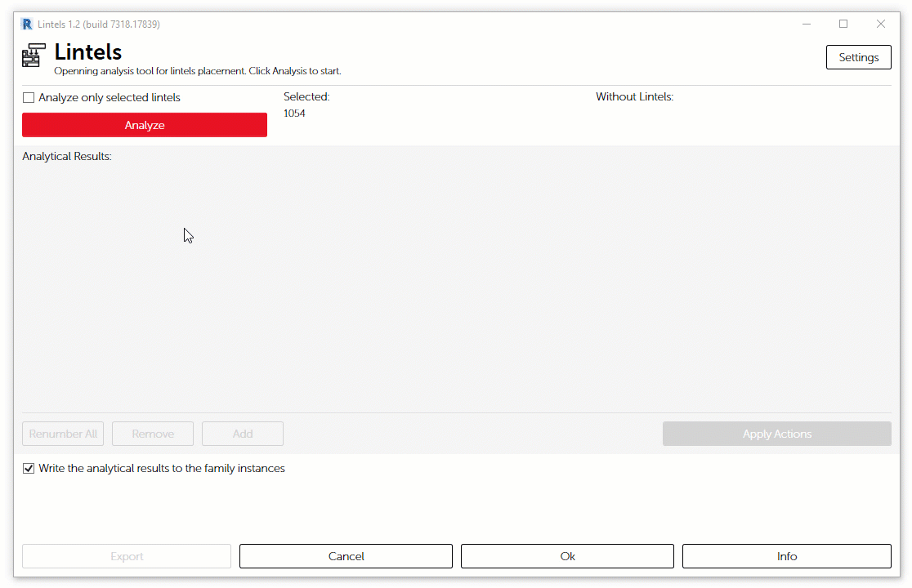
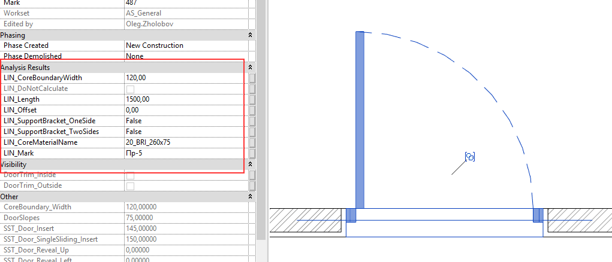

# Lintels

Для того, чтобы упростить принятие решения по необходимым типам перемычек в проекте, проанализировать проемы можно воспользовавшись приложением **Lintels**, которое входит в состав **Apex AS**.

##  **Подготовка модели**

При первичном запуске приложения, будет выполнена проверка модели на возможность выполнения автоматизированного расчета. Возможно появление ряда предупреждающих окон.

Если в проекте в составе многослойных конструкций присутствуют настроенные не по Стандарту материалы, это потенциально может привести к некорректному результату. Поэтому для устранения замечаний вам будет предложено воспользоваться приложением **BIM Inspector**.

При отсутствии или неактуальности семейств проемов **A\_DOR\_Door** и  **A\_MEQ\_OpeningWall-Rectangular**l или вложенные в них элементов будет предложено обновить их самостоятельно из библиотеки семейств Apex.

Семейство **A\_DIT\_Lintel** \(Тип перемычки\) а также параметры проекта при отсутствии будут загружены автоматически.


 Обратите внимание, что у семейств проемов, например **A\_DOR\_Door**, есть параметр **LIN\_Jumper.** Его значение определяет "свес" перемычки относительно проема. Таким образом, значение равное 0.00 будет означать отсутствие необходимости в перемычке.


## **Анализ**

Нажмите кнопку **Analyze** для начала анализа. Процесс может занять некоторое время в зависимости от размера анализируемой модели.

Проемы группируются по ряду параметров таких, как длина и ширина предполагаемой  перемычки, а  также количества дополнительных опор вроде металлического пристенного уголка и пользовательского комментария. 

В таблицу **Analytical Results** выводится список предполагаемых типов перемычек в виде нескольких столбцов

> 1. Краткая информация о том, какие перемычки должны быть в проекте
> 2. Количество проемов
> 3. Действия, чтобы привести в соответствие текущие Типы

В каждой позиции из списка возможны 4 действия

> 1. Действие не требуется.
> 2. Будет создан новый Тип
> 3. Тип будет удален
> 4. Существующий тип перемычки будет актуализирован \(название Типа, номер марки, значение количества проемов, которым соответствует данный тип\)

Далее финализируем результат

> 1. При нажатии на кнопку **Apply Actions** к Типам перемычек будут применены указанные действия.
> 2. Выбранная опция **Write The Analytical Results to The Family Instances** позволит записать результаты анализа в экземпляры семейств проемов
> 3. Нажатие на **Ok** применит действия и закроет окно. Нажатие на **Cancel** закроет окно без сохранения результатов анализа

Результат сохраняется в качестве значений в группе параметров **Analysis Results** проемов, а также продублирован во вложенный элемент графического представления перемычки в плане 

В дальнейшем эти данные можно использовать при составлении ведомости перемычек.


Если задать значение параметру **LIN\_DoNotCalculate** - Yes \(галочка\), параметры габаритов перемычки такого элементы не будут переопределены при автоматическом расчете.


## Управление марками

Информация о присвоенных номерах марок это значения параметра **Type Mark** у Типов семейства **DIT\_Lintel**

Для управления номерами марок доступны следующие инструменты:

> 1. Двойной клик по ячейке с маркой позволяет изменить номер
> 2. Командам Renumber All применит сквозную нумерацию в соответствии с сортировкой
> 3. Кнопка Remove активна, когда выбранный Тип в таблице не имеет экземпляров проемов в проекте, и позволяет удалить такой Тип

Каждый раз при расчете, приложение ищет в списке уже существующую запись о перемычке данного типа и, если таковая имеется, использует марку из записи.

Таким образом можно хранить историю типоразмеров перемычек в проекте, а также гибко настраивать марку для каждой позиции.

