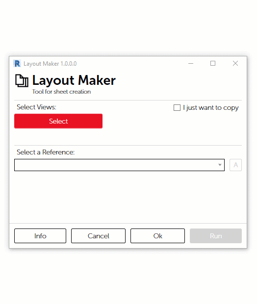
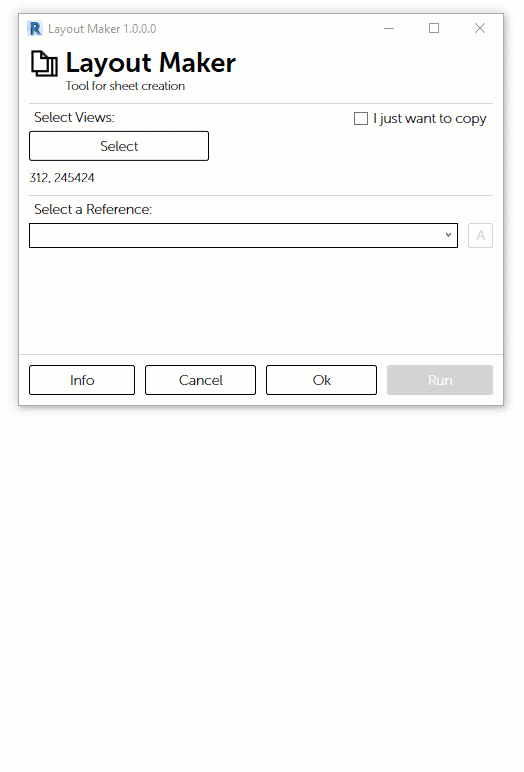

# Layout Maker

Для быстрой и удобной верстки видов на листы в среде Revit, разработан инструмент "Layout Maker". Позволяет по подобию имеющегося листа-шаблона оформить большое количество листов.

## Основной функционал

Инструмент можно найти на панели инструментов в закладке Apex AS. Запустите его.

Нажмите кнопку "Select", чтобы выбрать Виды

Выберите из списка лист, который будет использоваться в качестве шаблона для создаваемых листов.

Элементы на опорном листе-шаблоне отобразятся в виде карточек

> 1. Опционально можно изменить значения параметров создаваемых элементов
> 2. Галочка "Main" означает что данный видовой экран будет использоваться для размещения выбранных Видов
> 3. Опция "Duplicate" создает дубликат элемента при создании листов

## Дополнительные возможности

Опция "Ijust want to copy" позволяет просто создать копию выбранных видов и применить им другой Тип со связанным  шаблоном вида. Например, если необходимо сделать на основе Видов стадии П Виды АГР.

Из диалогового окна "Layout Maker" доступен инструмент "[Create Album](create-album.md)", при помощи которого можно добавить специфические для проектной стадии или дисциплины элементы в проект, например шаблоны листов. 

> 1. Кнопка вызова [Create Album](create-album.md)

