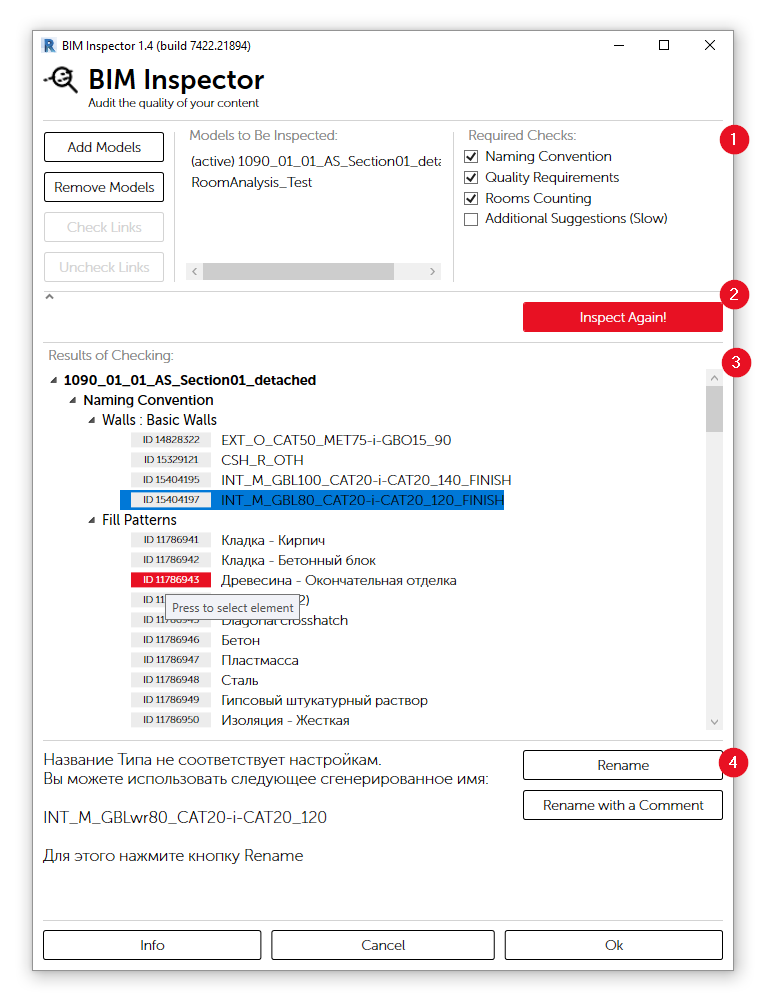
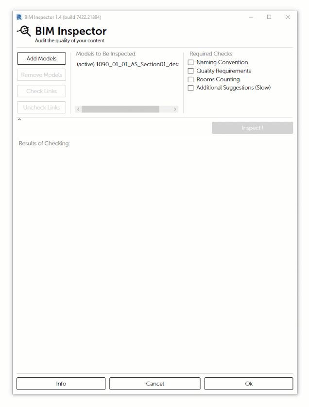
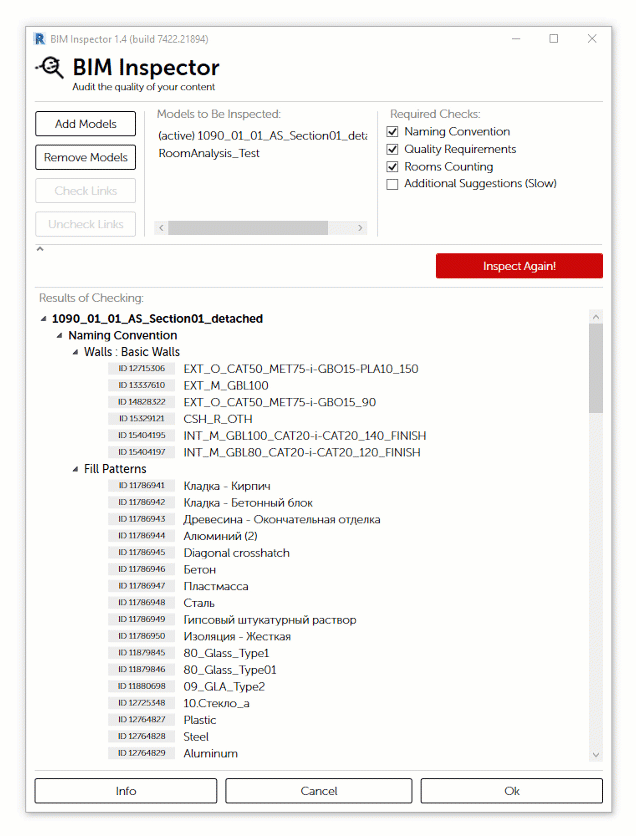

# BIM Inspector

Для контроля и обеспечения качества проектных файлов доступно приложение **BIM Inspector**, которое входит в состав **Apex AS**.

> 1. Настройки
> 2. Кнопка запуска проверки
> 3. Отчет
> 4. Блок с описанием и выбором опций решений

## Настройки

Блок настроек содержит три секции

* Кнопки управления списком моделей для проверки
* Список моделей, которые будут проинспектированы
* Список групп проверок

С полным списком проверок вы можете ознакомится в [соответствующем разделе](polnyi-spisok-proverok.md)

## Отчет

Кнопка **Inspect!** запускает проверку, по результату которой выводится отчет.

Отчет сгруппирован в иерархическом порядке:

* Модели
  * Группы проверок
    * Проверки
      * Элементы, требующие внимания 


Напротив названия элемента, присутствует кнопка с **ID** элемента, при нажатии на которую будет выделен элемент, а его **ID** будет скопирован с буфер обмена.


## Опции решения

В некоторых случаях **BIM Inspector** позволяет произвести изменение с элементом.

При выделении элемента в списке, появляется блок с описанием предупреждения и опциями решения.

С полным списком опций вы можете ознакомится в [соответствующем разделе](opcii-resheniya.md)

## Экспорт результатов проверки

Начиная с версии **1.5**, доступна возможность экспортировать отчет.

После выбора папки для сохранения, отчет по каждой инспектируемой модели будет сохранен в формате **.html** и открыт в браузере.

