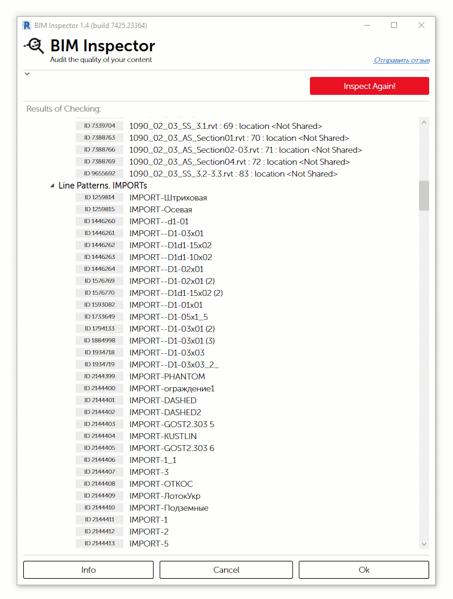

# Опции решения

## **More Info**

Вывод дополнительных сведений о том в составе каких элементах используется материал 

## **Select Name**

Выбор имени из списка c возможностью добавить комментарий

> 1. Поля поиска
> 2. Текущее название
> 3. Поле ввода комментария \(необязательно\)

## Set Material Class

Назначает класс материалу в соответствии с именем

## **Rename**

Применяет автоматически сгенерированное имя элементу

## **Rename with a Comment**

Применяет автоматически сгенерированное имя элементу с комментарием

## Delete with Replacement

Данная опция позволяет удалить выбранный материал с заменой на другой, там где он использовался.


В текущей версии программы замена материала производится только в составе многослойных конструкций, например таких элементов как стены, перекрытия, крыши.


## **Set Yes**

Выставляет значение **Yes** свойству **FAM\_DuplicateSS**

## **Set No**

Выставляет значение **No** свойству **FAM\_DuplicateSS**

## **Create WS / Move-to-Existing**

Создает новый рабочий набор с корректным именем и переносит в него связанный файл. Либо, если рабочий набор с таким именем уже есть, просто переносит связанный файл. 

## **Rename Workset**

Переименовывает рабочий набор в соответствии с названием связанного файла

## **Delete**

Удаляет выделенный элемент из модели

## Select Type

Выбор значения **ROM\_RoomType** из списка

## Auto Resolve

Некоторые опции могут быть применены к группе элементов автоматически.

