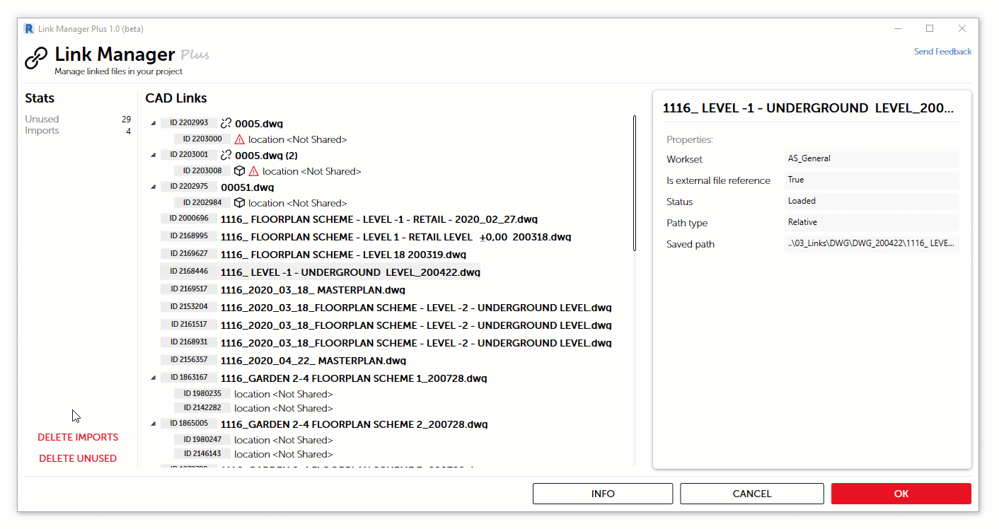

# Link Manager Plus

С целью помочь сдерживать энтропию в проектных файлах, в приложение **Apex AS** добавлен инструмент **Link Manager Plus**

Диалоговое окно разделено на несколько областей:

* **Stats**
* **CAD Links**

## Stats

В этой части экрана отображается общая статистика. 

Количество неиспользуемых связей \(**Unused**\) - это те связи, которые не имеют размещенных экземпляров

**Imports** - экземпляры связей размещенные в проект командой **Import CAD**

В нижней части две кнопки-команды с говорящими названиями, которые позволяют очистить модель от потенциально лишних элементов. 

## CAD Links

Содержит список всех САПР связей в модели. Типы и его экземпляры

> 1. Пиктограмма означает, что в связи отсутствует информация о её внешнем источнике
> 2. Так обозначаются IMPORT'ы
> 3. "Кубик" говорит о том, что экземпляр связи размещен в пространство модели, а не на вид

При выделении элемента в списке показывается панель с информацией об элементе.

