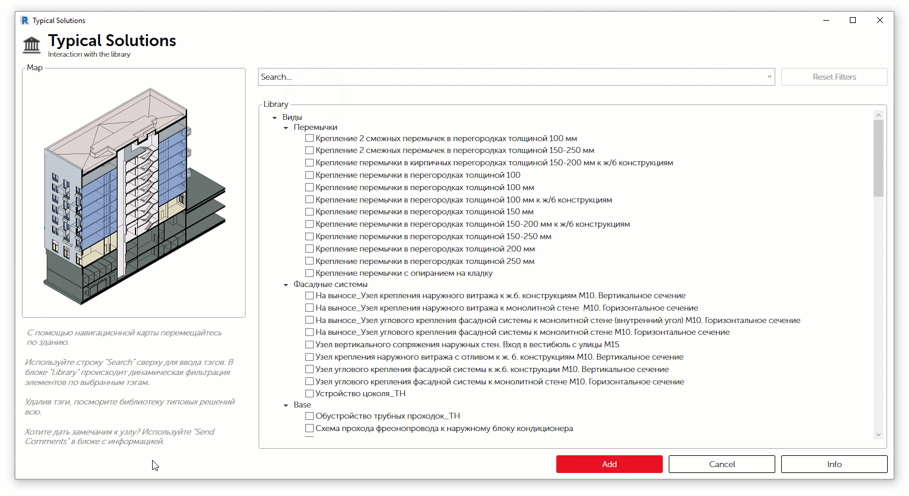

# Typical Solutions

Интерфейс представляет собой дерево узлов с левой стороны и окно просмотра с правой. Выбрав необходимый узел, необходимо нажать кнопку "Добавить узел в проект", после чего узел загрузится как чертежный вид и будет доступен из диспетчера видов в открытом файле Revit.

В библиотеку будут постоянно добавляться новые решения.

Все предложения по работе с типовыми решениями \(узлы, санузлы, ЛЛУ\) можно направлять по почте на [+BIMGroupArchitects](mailto:bim-as@apex-project.ru?subject=ApexAS.%20TypicalSolutions).

