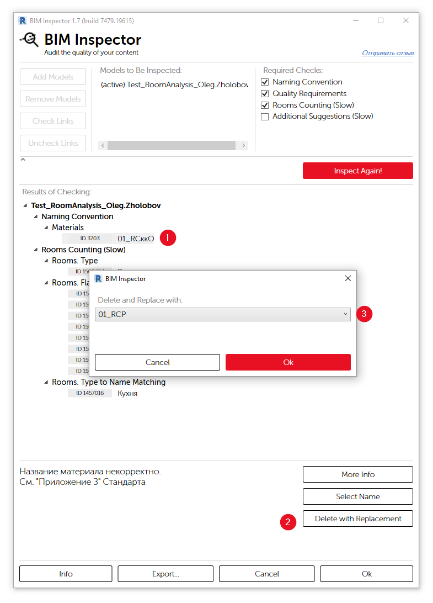

# 2020-06-23

## Apex AS

### Добавлена кнопка Standard

Открывает Стандарт предприятия в формате PDF

### Выпадающее меню у кнопки Apex INFO

Позволяет быстро перейти на нужный раздел базы знаний [Apex INFO](https://apex-life.ru/Courses/Home)

## Room Analysis

### Объединены расчеты **Flats** и **Public Areas**

При запуске обновляются значения площадей всех помещений. Нет необходимости запускать два расчета.

### Быстрый запуск расчета

Реализован запуск расчета с последними сохраненными настройками без необходимости открытия окна c конфигурацией плагина.

Для удобного использования можно назначить комбинацию клавиш, например **QR**

## BIM Inspector

### Новая опция **Delete with Replacement**

Данная опция позволяет удалить выбранный материал с заменой на другой, там где он использовался.


В текущей версии программы замена материала производится только в составе многослойных конструкций, например таких элементов как стены, перекрытия, крыши.


### Экспорт результатов проверки

Начиная с версии **1.5**, доступна возможность экспортировать отчет, для удобной работы с ним

После выбора папки для сохранения, отчет по каждой инспектируемой модели будет сохранен в формате **.html** и открыт в браузере.

## Lintels

### Увеличена скорость расчета

Значительно переработан алгоритм расчета, что позволило увеличить скорость и стабильность работы плагина.

### Выборка по фильтру 

Теперь можно ограничить выборку проемов и работать только с ней. Это бывает необходимым в ряде случаев, например, когда в одном файле нужно сделать несколько комплектов с независимой нумерацией марок.

Выборку можно создать применив одинаковое значение параметру **LIN\_Filter** у проемов.


Если в проекте отсутствует данный параметр, достаточно просто открыть плагин и нажать кнопку **Ok**. Параметр будет загружен в проект.


### Расчет выбранных элементов

При расчете только выбранных элементов \(опция **Analyse only selected openings**\), теперь также, как и при основном расчете доступны изменения Типов перемычек \(**Upgrade**, **Create**, **Delete**\).

### Страница с часто задаваемыми вопросами

На портале в разделе **INFO** добавлена [страница ](https://apex-life.ru/Courses/Course?Id=129&PageId=8534)с часто задаваемыми вопросами

## bim-as.apex

Улучшена страница со списком проектов

Удобная навигация, возможность просмотреть детализацию проекта из списка.

Добавлен календарь активности проекта

Страница с детализацией пользователя

Унифицирован дизайн страниц со списком проектов и со списком пользователей

### Статус пользователя \("In Model"\)

### Исправлено проксирование протокола WebSockets

Расширена информация на странице с предупреждениями

