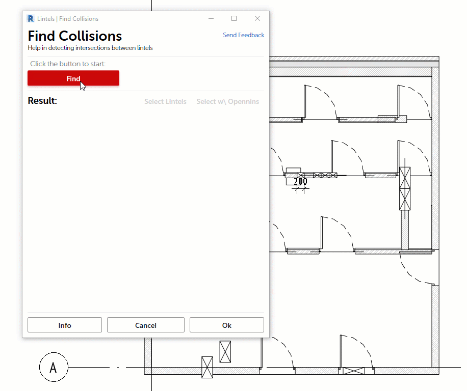

# 2020-10-19

## Apex AS

Добавлены новые команды

* **Find Collisions** в свиток **Lintels**
* **Floors** в свиток **Finishing 3D**
* **Link Manager**
* **Check Version**

Улучшения во внешнем виде элементов пользовательского интерфейса команд.

Исправления и улучшения в существующих командах.

## **Check Version**

Команда позволяет узнать актуальна ли версия приложения 

## Create Album

Добавлены шаблоны листов стадии П

## Lintels 

Добавлен анализ высоты стены над проемом. 

Вывод информации на главный экран о текущем значении **LIN\_Filter**

## Lintels \| Find Collisions

Новый инструмент, помогающий выявить и устранить коллизии между перемычками.

## Finishing 3D \| Floors

Инструмент строит полы по указанным помещениям

## Link Manager

С целью помочь сдерживать энтропию в проектных файлах, в приложение **Apex AS** добавлен инструмент **Link Manager Plus**

Диалоговое окно разделено на несколько областей:

* **Stats**
* **CAD Links**

### Stats

В этой части экрана отображается общая статистика. 

Количество неиспользуемых связей \(**Unused**\) - это те связи, которые не имеют размещенных экземпляров

**Imports** - экземпляры связей размещенные в проект командой **Import CAD**

В нижней части две кнопки-команды с говорящими названиями, которые позволяют очистить модель от потенциально лишних элементов. 

### CAD Links

Содержит список всех САПР связей в модели. Типы и его экземпляры

> 1. Пиктограмма означает, что в связи отсутствует информация о её внешнем источнике
> 2. Так обозначаются IMPORT'ы
> 3. "Кубик" говорит о том, что экземпляр связи размещен в пространство модели, а не на вид

При выделении элемента в списке показывается панель с информацией об элементе.

